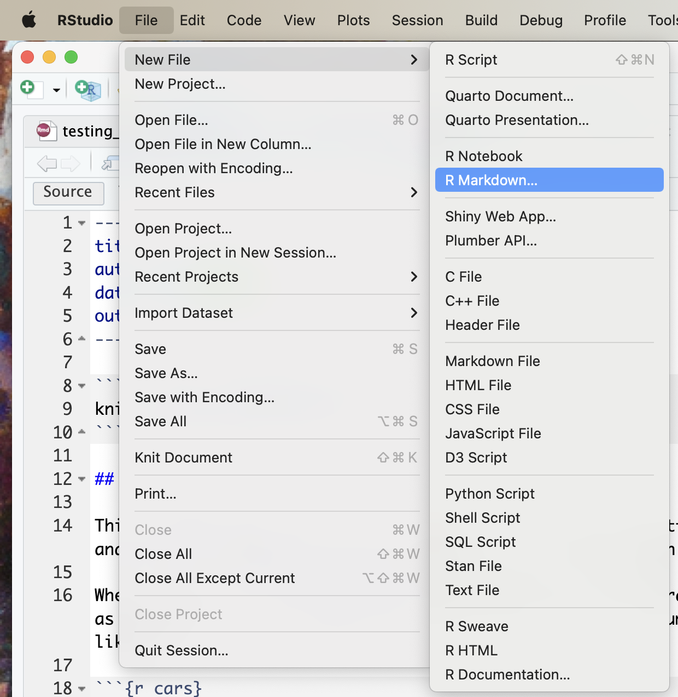
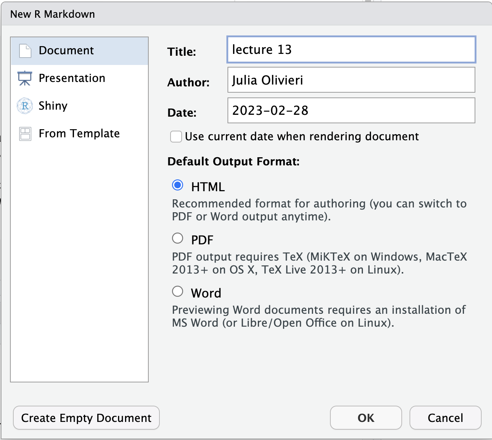
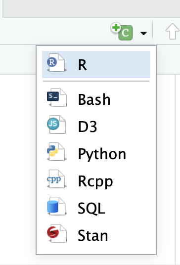

# Lecture 13 instructions

## Creating an R Markdown file

In RStudio, choose File --> R Markdown

Choose a title and click OK:

Now you have access to an R Markdown file. You can try editing the text outside of the gray code blocks. 

## Editing Markdown

Try adding some more headings to the document, and a few words of text under each heading. The number of # signs before the heading name indicates its size (the more #, the smaller it will be).

# `#` Header 1

Section 1 here

## `##` Header 2

Subsection here

### `###` Header 3

Subsubsection here

#### `####` Header 4

Subsubsubsection here

## Editing code

You can add a new code block by clicking the +c button on the top bar, and choosing R:

Try writing a line of code to execute here, for example add a few numbers together.

## Creating the finished file

Choose the "Knit" button on the top bar to create the finished file. You can choose what kind of file output you want each time you knit your file.

